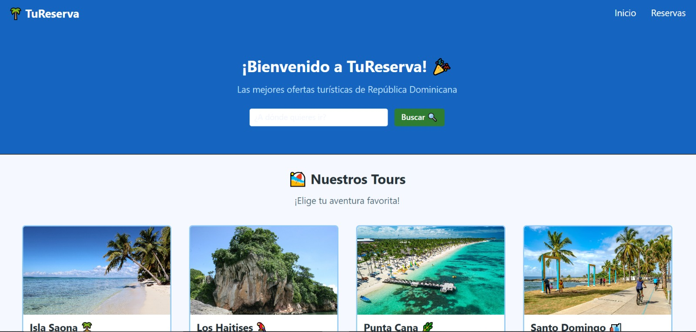
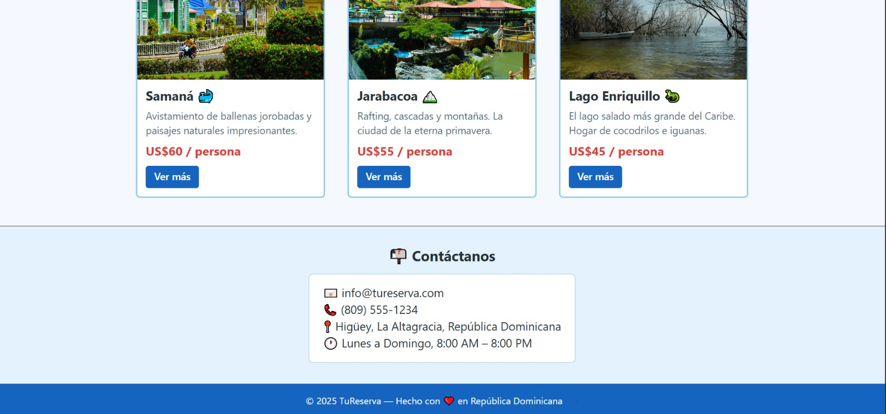

Proyecto Final – Desarrollo Web: “Plataforma de Reservas y Ofertas Turísticas”
Objetivo: Diseñar y desarrollar una página web funcional que permita gestionar reservas y publicar ofertas turísticas, integrando una API conectada a una base de datos y desplegada en un servidor web con control de versiones en GitHub.

Requisitos del Proyecto:
Diseño y Desarrollo Web:

Crear paginas web responsive con Reflex (Pagina de Inicio, Pagina de Descripción y Pagina de Reservas).

La pagina de Inicio debe contener secciones como:

Formulario de busqueda
Ofertas Turísticas (con imágenes y descripciones)
Contacto o Información de la Empresa
Pagina de Descripcion debe contener secciones como:
Descripción general (con imágenes)
Detalles
Itinerario
Pagina de Reservas
Datos de contacto
Detalles de la actividad
Descripcion de pago
API + Base de Datos:

Crear una API REST para:

Consultar ofertas turísticas

Registrar reservas (POST)

Ver listado de reservas (GET)

Conectar la API a una base de datos MySQL.

Almacenar los datos de las reservas de forma segura.

Despliegue:

Subir el proyecto completo a GitHub, utilizando GitFlow para organizar las ramas de desarrollo.

Publicar la parte estática de la página y el servidor web en Render.

Documentar claramente el proyecto en el README.md, incluyendo:

Descripción del proyecto

Cómo instalar y ejecutar

Estructura de carpetas

Créditos y enlaces útiles


--Documentación

# TuReserva — Plataforma de Reservas Turísticas

 Plataforma web desarrollada con **Reflex (Python)** para la gestión de reservas y la promoción de destinos turísticos en República Dominicana.

---

## Descripción

**TuReserva** es una aplicación web diseñada para facilitar la búsqueda y reserva de actividades turísticas. Los usuarios pueden explorar diferentes destinos, consultar información detallada de los tours y realizar reservas en línea de forma sencilla.

Además, la plataforma incluye un **panel administrativo** que permite gestionar tanto las reservas como los destinos turísticos publicados.

---

## Funcionalidades

### Para los usuarios

* Buscar destinos turísticos.
* Explorar ofertas y paquetes disponibles.
* Consultar información detallada de cada tour.
* Realizar reservas en línea.
* Seleccionar métodos de pago disponibles.
* Acceder a información de contacto.

### Para administradores

* Agregar nuevos tours.
* Eliminar tours existentes.
* Visualizar reservas registradas.
* Editar información de reservas.
* Confirmar reservas.
* Cancelar o eliminar reservas.

---

## Estructura de la Aplicación

| Página         | Descripción                                                       |
| -------------- | ----------------------------------------------------------------- |
|Inicio      | Buscador de destinos, ofertas destacadas e información general.   |
| Descripción | Información detallada, itinerario y características de cada tour. |
| Reservas    | Formulario para registrar reservas y datos de contacto.           |
| Admin       | Gestión de reservas y destinos turísticos.                        |

---

## Instalación y Ejecución

### Requisitos Previos

* Python 3.10 o superior
* pip
* Git

### 1. Clonar el repositorio

```bash
git clone https://github.com/tu-usuario/tureserva.git
cd Plataforma_de_reservas
```

### 2. Crear un entorno virtual

```bash
python -m venv venv
```

### 3. Activar el entorno virtual

**Windows**

```bash
venv\Scripts\activate
```

**Linux / macOS**

```bash
source venv/bin/activate
```

### 4. Instalar dependencias

```bash
pip install reflex
```

### 5. Ejecutar la aplicación

```bash
reflex run
```

### 6. Abrir en el navegador

```text
http://localhost:3000
```

---

## Tecnologías Utilizadas

* **Reflex** — Framework web basado en Python.
* **Python 3.10+**
* **MySQL** — Base de datos administrada por el equipo de backend.
* **Git y GitHub** — Control de versiones.

---
## Estructura de carpetas

```
CamilaVG-Git/
│
├── .vscode/                        # Configuración del editor
│
├── Capturas/                       # Capturas de pantalla del proyecto
│
├── Plataforma_de_reservas/         # Carpeta principal de la aplicación
│   ├── assets/                     # Imágenes de los destinos turísticos
│   │   ├── isla_saona.jpg
│   │   ├── los_haitises.jpg
│   │   ├── punta_cana.jpg
│   │   └── ...
│   ├── Plataforma_de_reservas/
│   │   └── Plataforma_de_reservas.py   # Código principal
│   └── rxconfig.py                 # Configuración de Reflex
│
├── .gitignore                      # Archivos ignorados por Git
├── LICENSE                         # Licencia del proyecto
└── README.md                       # Documentación
```
---
## Capturas de Pantalla

### Página de Inicio





### Página de Reservas


### Panel Administrativo


---

# Tourism Platform API

API REST desarrollada con **FastAPI** y **MySQL** para gestionar ofertas turísticas y reservas.

---

## Descripción

Esta API forma parte del proyecto **Plataforma de Reservas y Ofertas Turísticas**. Permite:
- Consultar ofertas turísticas disponibles
- Registrar reservas de clientes
- Ver y gestionar el listado de reservas
- Controlar la disponibilidad de cupos automáticamente

---

## Cómo instalar y ejecutar

### 1. Clonar el repositorio
```bash
git clone https://github.com/tu-usuario/tourism-platform.git
cd tourism-platform/tourism-api
```

### 2. Crear entorno virtual e instalar dependencias
```bash
python -m venv venv
source venv/bin/activate        # Linux/Mac
venv\Scripts\activate           # Windows

pip install -r requirements.txt
```

### 3. Configurar variables de entorno
```bash
cp .env.example .env
# Edita .env con tus credenciales de MySQL
```

### 4. Crear la base de datos en MySQL
```bash
mysql -u root -p < setup_db.sql
```

### 5. Iniciar el servidor
```bash
uvicorn app.main:app --reload
```

### 6. (Opcional) Poblar con datos de ejemplo
```bash
python seed.py
```

### 7. Ver documentación interactiva
Abre en tu navegador: [http://localhost:8000/docs](http://localhost:8000/docs)

---

## Estructura de carpetas

```
tourism-api/
├── app/
│   ├── main.py                  # Punto de entrada de la aplicación
│   ├── database/
│   │   └── connection.py        # Conexión a MySQL con SQLAlchemy
│   ├── models/
│   │   └── models.py            # Modelos de base de datos (ORM)
│   ├── schemas/
│   │   └── schemas.py           # Validación de datos con Pydantic
│   └── routers/
│       ├── offers.py            # Endpoints de ofertas turísticas
│       └── reservations.py      # Endpoints de reservas
├── seed.py                      # Script para datos de prueba
├── setup_db.sql                 # Script SQL de configuración
├── requirements.txt             # Dependencias de Python
├── render.yaml                  # Configuración de despliegue en Render
├── .env.example                 # Plantilla de variables de entorno
└── .gitignore
```

---

## 🔗 Endpoints principales

| Método | Endpoint | Descripción |
|--------|----------|-------------|
| GET | `/api/v1/offers/` | Listar todas las ofertas |
| GET | `/api/v1/offers/{id}` | Detalle de una oferta |
| POST | `/api/v1/offers/` | Crear nueva oferta |
| POST | `/api/v1/reservations/` | **Registrar una reserva** |
| GET | `/api/v1/reservations/` | Ver todas las reservas |
| GET | `/api/v1/reservations/{id}` | Detalle de una reserva |
| PATCH | `/api/v1/reservations/{id}/status` | Actualizar estado de pago |

---

## ☁️ Despliegue en Render

1. Sube el proyecto a GitHub
2. En [Render](https://render.com), crea un **Web Service** conectado a tu repositorio
3. Configura la variable de entorno `DATABASE_URL` en el dashboard de Render
4. Render usará el `render.yaml` para el despliegue automático

---

## Tecnologías utilizadas

- [Aiven](https://aiven.io/) — Base de datos MySQL en la nube
- [GitHub](https://github.com/) — Control de versiones con GitFlow
- [Render](https://render.com/) — Despliegue del servidor web
- [MySQL Workbench](https://www.mysql.com/products/workbench/) — Gestión visual de la base de datos
- [VS Code](https://code.visualstudio.com/) — Editor de código

---

## Recursos

* Documentación oficial de Reflex
* Guía de GitHub
* Documentación de Render

---

## Equipo de Desarrollo

| Integrante           | Rol                           |
| -------------------- | ----------------------------- |
| Angelica Valdez            | Frontend y diseño de interfaz |
| Karla Aquino | Backend y base de datos       |

---

## Licencia

Proyecto académico desarrollado como parte de la asignatura de **Desarrollo Web**.

